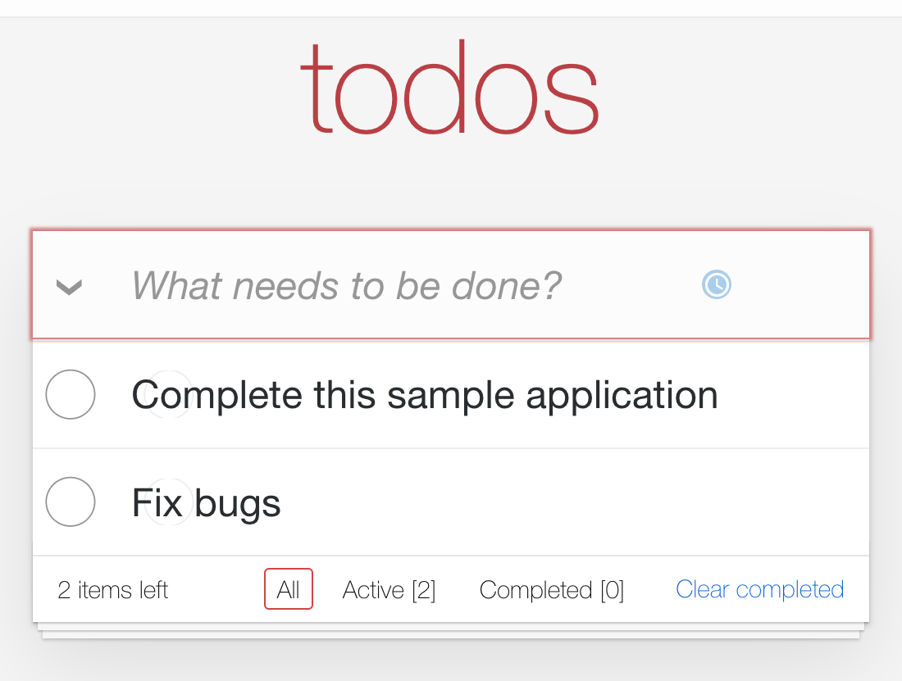
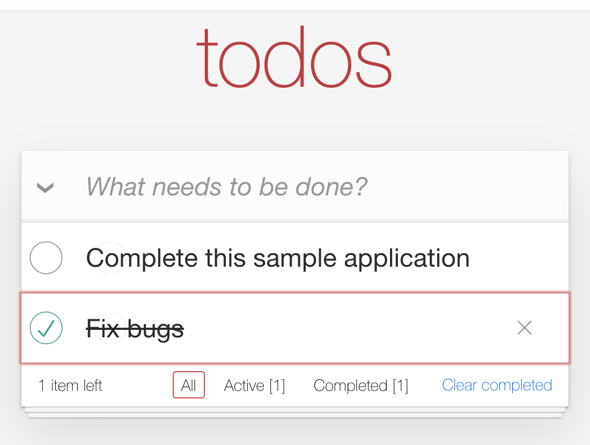
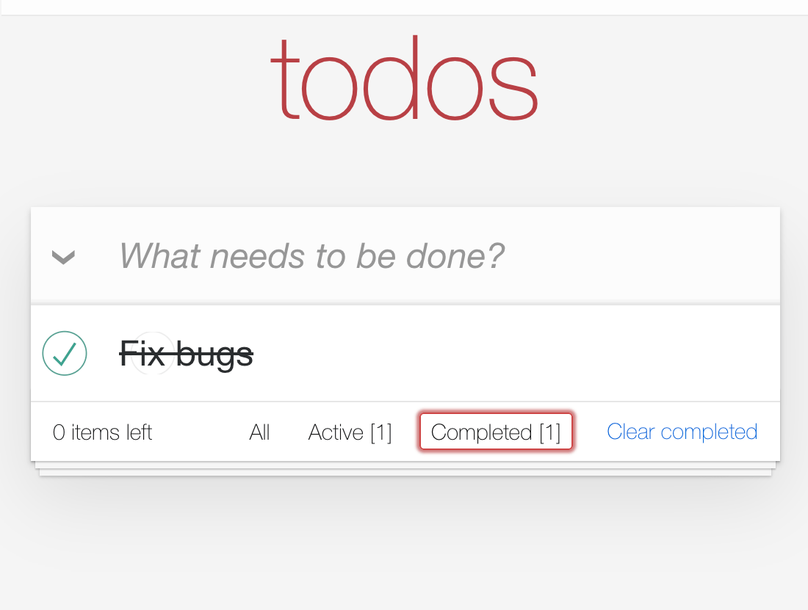

# TodoMVC

Implementation of TodoMVC in Phoenix v1.5.9 / LiveView v0.15.7

### Table of Contents

* [Summary](#summary)
* [Instructions](#instructions)
* [Developer Diary](#developer-diary)
* [Deploying to Heroku](#deploying-to-heroku)
* [Demo](#demo)
    * [Screenshots](#screenshots)
* [Phoenix Readme](#phoenix-readme)
    * [Learn more](#learn-more)

## Summary

The primary purpose of this project was to get a further understanding of Phoenix and LiveView by following [DWYL's Phoenix Todo List Tutorial](https://github.com/dwyl/phoenix-todo-list-tutorial) with a curveball: use LiveView instead of the traditional "dead views".
By following a tutorial for the major parts and "coloring outside those lines", I step just a little further outside the comfort zone following a tutorial alone gives me. This approach "changes the goalposts" though so there is a sort of blindness as to how functionality should behave. Fortunately, nothing seems terribly off.

[A year later]...
I realized it would be useful to deploy this project to Heroku so I could understand how to deploy this to production. I was tempted to put this on my personal site [braytonium.com] but I have other projects in the pipeline for that.

## Instructions

See [the documentation](docs/instructions.md) for the steps performed to complete this project from `mix phx.new ...` to completion.

## Developer Diary

I wanted to document my understanding as I progressed each day so I kept a development diary.

[A year later]...
This was one of my earliest Phoenix projects and my very first introduction to completing something with LiveView.

1. [Day 1](docs/diary/day01.md)
2. [Day 2](docs/diary/day02.md)
3. [Day 3](docs/diary/day03.md)
4. [Day 4](docs/diary/day04.md)
5. [Day 5](docs/diary/day05.md)
6. [Day 6](docs/diary/day06.md)
7. [Day 7](docs/diary/day07.md)
8. [Day 8 & Postmortem](docs/diary/day08.md)

## Deploying to Heroku

Follow the [deployment instructions](docs/heroku-deployment.md) to deploy this application to Heroku.

## Demo

Click [https://pacific-savannah-85771.herokuapp.com/] to view the application in your browser.

### Screenshots

1. { width=60%,height:30px }
2. { width=60%,height:30px }
3. { width=60%,height:30px }
4. { width=60%,height:30px }
5. { width=60%,height:30px }
6. { width=60%,height:30px }

## Phoenix Readme

To start your Phoenix server:

* Install dependencies with `mix deps.get`
* Create and migrate your database with `mix ecto.setup`
* Install Node.js dependencies with `npm install` inside the `assets` directory
* Start Phoenix endpoint with `mix phx.server`

Now you can visit [`localhost:4000`](http://localhost:4000) from your browser.

Ready to run in production? Please [check our deployment guides](https://hexdocs.pm/phoenix/deployment.html).

### Learn more

* Official website: [https://www.phoenixframework.org/]
* Guides: h[ttps://hexdocs.pm/phoenix/overview.html]
* Docs: [https://hexdocs.pm/phoenix]
* Forum: [https://elixirforum.com/c/phoenix-forum]
* Source: [https://github.com/phoenixframework/phoenix]
